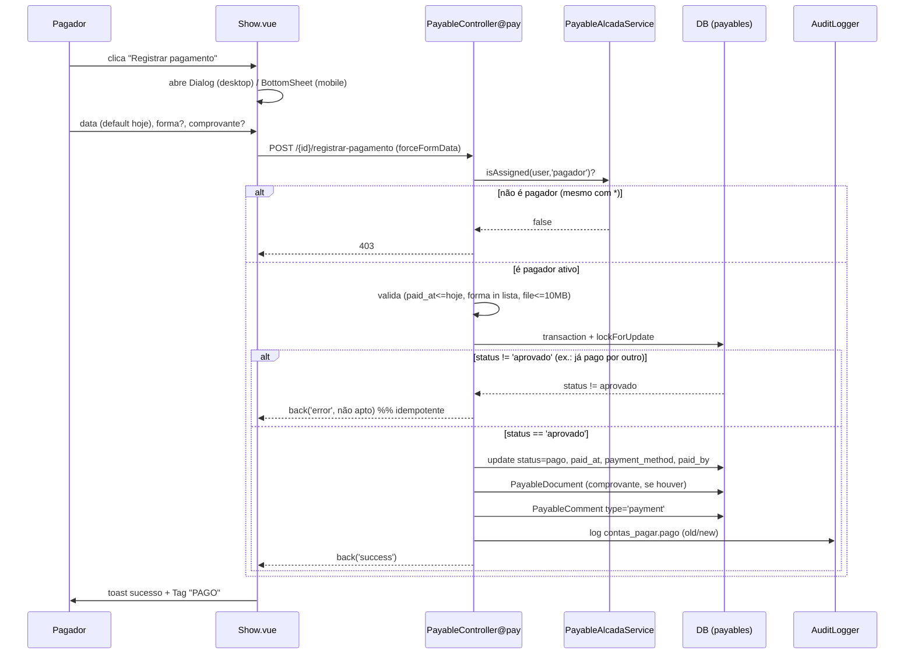
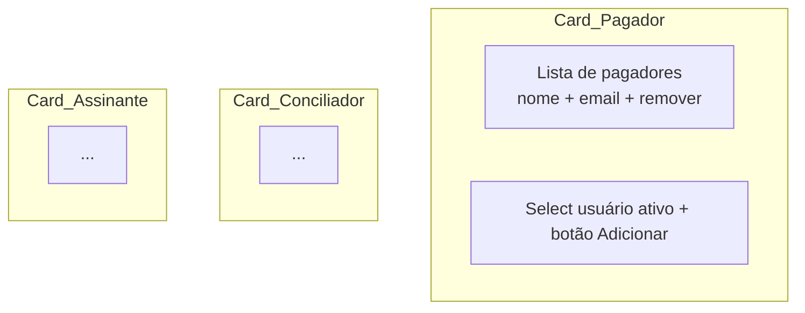
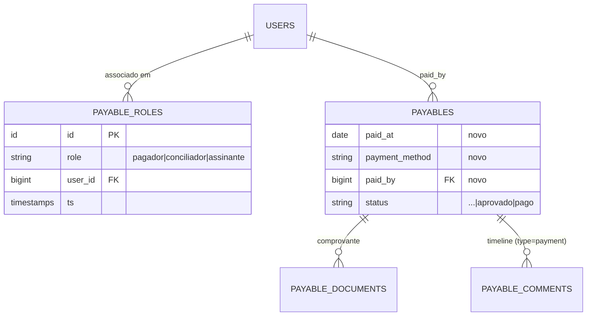

# Design Document

## Overview

Esta spec adiciona **duas peças** ao módulo Contas a Pagar, de forma **incremental sobre o `Payable` existente** (nada é apagado):

1. **Cadastro de Alçada do Contas a Pagar (Alcada_CP)** — uma tela de configuração própria do módulo que mapeia **papel → usuário(s)** (`pagador`, `conciliador`, `assinante`), editável em tempo real. É a **fonte de verdade** de quem executa cada ação do fluxo de pagamento.
2. **Registrar pagamento** — a ação que transiciona um título de `aprovado` → `pago`, executável **apenas** por quem está na Alcada_CP como `pagador` (nem o curinga `*` fura essa regra).

O `status` `pago` **já existe** em `Payable::STATUS_LABELS`/`STATUS_COLORS`; hoje nenhuma ação faz a transição. Esta spec cria essa ação e o cadastro que a governa.

Os três papéis nascem juntos no cadastro (para a configuração ser coesa), mas **só o `pagador` é consumido por uma ação aqui**. `conciliador` e `assinante` passam a ser usados nas Specs 2 e 3.

### Princípios que guiam o design

- **Reaproveitamento máximo**: estende `Payable`, `PayableController`, `PayableComment`, `PayableDocument`, `AuditLogger`, a tela `Payables/Show.vue` e o `PayableSeeder`. Espelha o padrão de `approve()`/`reject()`/`sendForApproval()`.
- **Segregação de função acima da permissão**: a ação de pagar é governada pela **alçada**, não por permissão. A permissão (`*` inclusive) só dá acesso ao módulo e à **gestão** da alçada.
- **Estado de origem sempre validado**: a transição só ocorre a partir de `aprovado` (como os métodos atuais já fazem).
- **Auditoria + timeline em toda transição** (regra `auditoria.md`).
- **Mobile dedicado** (`useDevice()`, bottom sheet, cards) e **`<Toast />`** nas telas com toast (regra `mobile-ux.md`).

## Architecture

### Visão de alto nível

```mermaid
flowchart LR
    subgraph Frontend [Vue + Inertia + PrimeVue]
        A[Payables/Alcada.vue<br/>gestão de alçada]
        S[Payables/Show.vue<br/>+ Registrar pagamento]
    end
    subgraph Backend [Laravel]
        AC[PayableAlcadaController]
        PC[PayableController@pay]
        SVC[PayableAlcadaService<br/>elegibilidade + map]
        M1[(payable_roles)]
        M2[(payables<br/>+ paid_at/payment_method/paid_by)]
        AUD[AuditLogger -> audit_logs]
    end

    A -->|index/store/destroy| AC
    AC --> SVC --> M1
    AC --> AUD
    S -->|POST registrar-pagamento| PC
    PC --> SVC
    PC --> M2
    PC --> AUD
    PC -.->|share canPay| S
```

### Permissão de acesso vs. alçada (duas camadas)

| Camada | Mecanismo | Aplica a |
|---|---|---|
| **Acesso ao módulo** | middleware `permission:financeiro.contas_pagar.visualizar` | ver lista/detalhe e alcançar a rota de pagamento |
| **Gestão da alçada** | middleware `permission:financeiro.contas_pagar.alcada_gerenciar` (curinga `*` concede) | abrir/alterar a Alcada_Admin |
| **Executar pagamento** | **pertencer à Alcada_CP como `pagador` e estar ativo** (checado no controller; `*` **não** fura) | a ação Registrar_Pagamento |

> **Decisão de nomenclatura da permissão.** O requirement R3.1 cita a ideia de uma permissão dedicada (`contas_pagar.alcada.gerenciar`). Para manter consistência com as chaves já existentes (`financeiro.contas_pagar.visualizar/preparar/aprovar`), adotamos a chave **`financeiro.contas_pagar.alcada_gerenciar`** (3 segmentos, estilo de `usuarios.gerenciar_permissoes`). É a mesma intenção do requirement, alinhada ao namespace do módulo.

> **Premissa.** Um `pagador` precisa também de `financeiro.contas_pagar.visualizar` para alcançar a tela/rota (você vê o título e então paga). O DemoSeeder garante essa permissão aos pagadores demo; `bruno@bstechsolutions.com` tem `*`.

### Fluxo de Registrar Pagamento (com concorrência)



## Components and Interfaces

### Backend

#### 1. Migration — `add_payment_fields_to_payables`

Adiciona colunas de pagamento à tabela `payables` (o enum de `status` **já** tem `pago`):

| Coluna | Tipo | Notas |
|---|---|---|
| `paid_at` | `date` nullable | data do pagamento (R5.1, R5.3) |
| `payment_method` | `string` nullable | Forma_Pagamento (R5.6) |
| `paid_by` | `foreignId` nullable → `users.id` (`nullOnDelete`) | quem pagou (R5.3) |

> **Sem `paid_amount`**: o pagamento é sempre **total** (R5.4), igual a `payables.amount`. Não duplicamos o valor para evitar divergência; o valor pago é registrado na auditoria. (Pagamento parcial é fora de escopo.)

#### 2. Migration — `create_payable_roles_table` (a Alcada_CP)

Pivot papel → usuário (estilo `user_permission`):

| Coluna | Tipo | Notas |
|---|---|---|
| `id` | `id` | PK |
| `role` | `string` (index) | `pagador` \| `conciliador` \| `assinante` |
| `user_id` | `foreignId` → `users.id` (`cascadeOnDelete`) | responsável |
| timestamps | | auditoria de quando foi associado |

- **Unique** composto (`role`, `user_id`) → impede duplicata (R2.4).
- Excluir o usuário remove suas associações (cascade).

#### 3. Model — `App\Models\PayableRole`

```php
class PayableRole extends Model
{
    protected $fillable = ['role', 'user_id'];

    public const ROLES = [
        'pagador'     => 'Pagador',
        'conciliador' => 'Conciliador',
        'assinante'   => 'Assinante',
    ];

    public const ROLE_DESCRIPTIONS = [
        'pagador'     => 'Registra o pagamento dos títulos aprovados.',
        'conciliador' => 'Concilia os pagamentos com o extrato bancário (Spec 2).',
        'assinante'   => 'Assina/encerra a conciliação — 2ª assinatura (Spec 3).',
    ];

    public function user(): BelongsTo { return $this->belongsTo(User::class); }
}
```

> **Por que `PayableRole` e não reusar permissões/roles?** A regra do projeto é "sem roles" **para autenticação/autorização**. Aqui "papel" é um **conceito de negócio do fluxo de pagamento** (quem paga/concilia/assina), não um papel de auth. O cadastro é a fonte de verdade do fluxo e vai **crescer** na Fase 1 (níveis gerência/diretoria por trilha) — por isso uma tabela própria, desacoplada de permissões.

#### 4. Service — `App\Services\PayableAlcadaService`

Centraliza elegibilidade (usado por `pay()` e pela tela) e o "mapa" da alçada (usado pela Alcada_Admin). Mantém o controller fino, espelhando o padrão de `AuditLogger`/`WorkflowService`.

```php
class PayableAlcadaService
{
    /** Usuários ATIVOS associados ao papel (elegibilidade — ignora inativos, R2.5). */
    public function eligibleUsers(string $role): Collection;

    /** true se o usuário está ATIVO e associado ao papel (R4.1). */
    public function isAssigned(User $user, string $role): bool;

    /** Há pelo menos um pagador ativo configurado? (R4.4) */
    public function hasRole(string $role): bool;

    /** Mapa para a Alcada_Admin: cada papel com label, descrição e usuários associados
     *  (inclui inativos, marcados com is_active=false, para o admin poder removê-los — R1). */
    public function map(): array;

    /** Associa (idempotente, sem duplicar — R2.4) + auditoria 'contas_pagar.alcada_atribuido'. */
    public function assign(string $role, int $userId, User $actor): PayableRole;

    /** Remove + auditoria 'contas_pagar.alcada_removido'. */
    public function unassign(string $role, int $userId, User $actor): void;
}
```

- `eligibleUsers`/`isAssigned` filtram por `users.is_active = true` → usuário inativado é desconsiderado na elegibilidade **sem** precisar removê-lo da alçada (R2.5).
- `map()` retorna **todos** os associados (com flag `is_active`) para a tela administrativa listar/remover (R1.1) — a distinção entre "listar na tela" e "elegível para pagar" mora aqui.
- Tempo real (R2.3): como a elegibilidade lê a tabela a cada chamada, qualquer alteração já vale na próxima ação. (Sem cache persistente.)

#### 5. Controller — `App\Http\Controllers\PayableAlcadaController`

| Método | Rota | Responsabilidade | Reqs |
|---|---|---|---|
| `index()` | GET `financeiro/contas-pagar/alcada` | `Inertia::render('Payables/Alcada', ['roles' => $svc->map(), 'availableUsers' => <ativos id,name,email>])` | R1, R8.1 |
| `store(Request)` | POST `.../alcada` | valida `role` ∈ chaves de `PayableRole::ROLES` e `user_id` `exists:users,id`; `$svc->assign()`; `back()->with('success')` | R2.1, R2.4, R3.3 |
| `destroy(role, userId)` | DELETE `.../alcada/{role}/{userId}` | `$svc->unassign()`; `back()->with('success')` | R2.2, R3.4 |

- Grupo protegido por `permission:financeiro.contas_pagar.alcada_gerenciar` → 403 sem a permissão; `*` concede (R1.4, R3.1, R3.2).
- Validação inválida (role inexistente, user inexistente) → 422 (`assertJsonValidationErrors` nos testes).

#### 6. `PayableController@pay` (novo método)

```php
public function pay(Request $request, int $id, PayableAlcadaService $alcada)
{
    $payable = Payable::findOrFail($id);
    $user = $request->user();

    // (R4.2) ALÇADA manda — nem o curinga '*' fura. Sem checar permissão aqui.
    if (! $alcada->isAssigned($user, 'pagador')) {
        abort(403, 'Você não está na alçada como pagador deste módulo.');
    }

    $data = $request->validate([
        'paid_at'        => ['required', 'date', 'before_or_equal:today'], // R5.1, R5.2
        'payment_method' => ['nullable', 'string', Rule::in(array_keys(Payable::PAYMENT_METHODS))], // R5.6
        'file'           => ['nullable', 'file', 'max:10240'], // 10MB — comprovante (R5.5)
    ]);

    DB::transaction(function () use ($payable, $user, $data, $request, $alcada) {
        // (R6.3) trava o registro p/ pagamento concorrente
        $fresh = Payable::whereKey($payable->id)->lockForUpdate()->first();

        // (R6.1/R6.2) só de 'aprovado'. 2º request concorrente cai aqui (idempotente).
        if ($fresh->status !== 'aprovado') {
            throw new PayableNotPayableException(); // vira back('error') no handler/abaixo
        }

        $old = $fresh->status;
        $fresh->update([
            'status'         => 'pago',
            'paid_at'        => $data['paid_at'],
            'payment_method' => $data['payment_method'] ?? null,
            'paid_by'        => $user->id,
        ]);

        // (R5.5) comprovante reaproveita PayableDocument
        $docName = null;
        if ($request->hasFile('file')) {
            $file = $request->file('file');
            $path = $file->store('payables/docs', 'public');
            PayableDocument::create([
                'payable_id'  => $fresh->id,
                'uploaded_by' => $user->id,
                'name'        => $file->getClientOriginalName(),
                'path'        => $path,
                'mime_type'   => $file->getMimeType(),
                'size'        => $file->getSize(),
            ]);
            $docName = $file->getClientOriginalName();
        }

        // (R7.2) timeline
        PayableComment::create([
            'payable_id' => $fresh->id,
            'user_id'    => $user->id,
            'body'       => 'Pagamento registrado em ' . \Carbon\Carbon::parse($data['paid_at'])->format('d/m/Y')
                            . ($data['payment_method'] ?? null ? " · {$data['payment_method']}" : '')
                            . ($docName ? " · Comprovante: {$docName}" : ''),
            'type'       => 'payment',
        ]);

        // (R7.1/R7.3) auditoria com old/new
        AuditLogger::log(
            event: 'contas_pagar.pago',
            module: 'financeiro.contas_pagar',
            description: "Título {$fresh->title_number} pago (R$ {$fresh->amount}) em "
                         . \Carbon\Carbon::parse($data['paid_at'])->format('d/m/Y'),
            auditable: $fresh,
            oldValues: ['status' => $old],
            newValues: ['status' => 'pago', 'paid_at' => $data['paid_at'],
                        'payment_method' => $data['payment_method'] ?? null, 'paid_by' => $user->id],
        );
    });

    return back()->with('success', 'Pagamento registrado.');
}
```

- O `PayableNotPayableException` é capturado e convertido em `back()->with('error', 'Este título não está apto a ser pago.')` (R6.2/R7.7). Alternativamente, faz-se a checagem antes da transação **e** dentro dela; a versão dentro da transação cobre concorrência (R6.3).
- **Rollback** automático da transação garante "sem pagamento parcial" se o anexo/persistência falhar (R5.7/R7.7).

> Adicionar `paid_at`, `payment_method`, `paid_by` a `Payable::$fillable` **e** a `Payable::WORKFLOW_FIELDS` (para a sincronização Senior não sobrescrever). Adicionar relação `paidBy(): BelongsTo` e o cast `paid_at => date`. Adicionar `Payable::PAYMENT_METHODS = ['PIX'=>'PIX','TED'=>'TED','Boleto'=>'Boleto','Dinheiro'=>'Dinheiro','Outro'=>'Outro']`.

#### 7. `PayableController@show` (ajuste)

- Eager-load `paidBy:id,name`.
- Passar props novas para a view:
  - `canPay` = `$alcada->isAssigned($user,'pagador') && $payable->status === 'aprovado'` (R4.1/R4.3/R8.2).
  - `paymentMethods` = `Payable::PAYMENT_METHODS` (select da forma).
  - `pagadorConfigured` = `$alcada->hasRole('pagador')` (para hint de "alçada não configurada" — R4.4, opcional na UI).
- Injetar `PayableAlcadaService` via type-hint no método.

> Constraint de rota: adicionar `->whereNumber('id')` ao `payables.show` (GET `financeiro/contas-pagar/{id}`) para não colidir com o GET `financeiro/contas-pagar/alcada`. Ver Rotas.

#### 8. Rotas (`routes/web.php`)

Adicionar dentro do grupo `auth`, **antes** do grupo `financeiro/contas-pagar` (ou com a constraint `whereNumber`):

```php
// Financeiro - Contas a Pagar - Alçada (gestão)
Route::prefix('financeiro/contas-pagar/alcada')
    ->middleware('permission:financeiro.contas_pagar.alcada_gerenciar')
    ->group(function () {
        Route::get('/', [PayableAlcadaController::class, 'index'])->name('payables.alcada.index');
        Route::post('/', [PayableAlcadaController::class, 'store'])->name('payables.alcada.store');
        Route::delete('/{role}/{userId}', [PayableAlcadaController::class, 'destroy'])
            ->whereNumber('userId')->name('payables.alcada.destroy');
    });
```

E dentro do grupo `financeiro/contas-pagar` existente:

```php
Route::get('/{id}', [PayableController::class, 'show'])->whereNumber('id')->name('payables.show'); // + whereNumber
// ... rotas atuais ...
Route::post('/{id}/registrar-pagamento', [PayableController::class, 'pay'])
    ->whereNumber('id')->name('payables.pay'); // NOVA
```

#### 9. Permissão (`PermissionsSeeder`)

Adicionar:

```php
['key' => 'financeiro.contas_pagar.alcada_gerenciar', 'label' => 'Gerenciar alçada do contas a pagar', 'module' => 'financeiro'],
```

#### 10. Menu (`MenuCatalog::all()`)

Adicionar ao grupo **Financeiro** (visível só com a permissão — o catálogo já filtra; satisfaz R8.1 e expõe no Ctrl+K via `MenuCatalog::availableTo`):

```php
['key' => 'contas_pagar_alcada', 'label' => 'Alçada (Contas a Pagar)', 'icon' => 'pi pi-sitemap',
 'href' => '/financeiro/contas-pagar/alcada', 'permission' => 'financeiro.contas_pagar.alcada_gerenciar', 'group' => 'Financeiro'],
```

> **Busca global (Ctrl+K)**: como `MenuCatalog::availableTo()` alimenta a busca global, o item já aparece. A Alcada_CP é uma tela de **configuração** (não uma entidade pesquisável registro a registro), então **não** há mudança no `SearchController`.

### Frontend

#### A. `resources/js/Pages/Payables/Alcada.vue` (nova tela)

- Layout responsivo no mesmo padrão de `Show.vue`: `<component :is="isMobile ? AppLayoutMobile : AppLayout">`.
- **`<Toast />`** no template + `useToast()` (gotcha conhecido).
- Estrutura por papel (desktop e mobile usam **cards verticais** — sem tabela, satisfazendo R9.1):
  - Card do papel: título (`Pagador`/`Conciliador`/`Assinante`), descrição (R1.3), lista de usuários associados (nome + e-mail).
  - Papel **sem responsável** → estado vazio explícito "Sem responsável definido" (R1.2).
  - Cada usuário tem botão **remover** (`dusk="alcada-remove-{role}-{userId}"`) → `router.delete(payables.alcada.destroy)`.
  - Controle de **adicionar**: PrimeVue `Select` (filtrável) de usuários ativos (`dusk="alcada-select-{role}"`) + botão **Adicionar** (`dusk="alcada-add-{role}"`) → `useForm({role,user_id}).post(payables.alcada.store)`.
- Sucesso de add/remove → `onSuccess` dispara `toast.add({severity:'success', ...})` e o Inertia recarrega `roles` (lista atualiza sem reload manual).
- `dusk="alcada-page"` no container raiz; `dusk="alcada-role-{role}"` em cada card.



#### B. `resources/js/Pages/Payables/Show.vue` (ajuste)

Adicionar, na **sidebar de ações**, um bloco "Pagamento" visível quando `canPay` (prop do servidor):

- **Desktop** (`!isMobile`): botão **"Registrar pagamento"** (`dusk="open-payment"`) abre um PrimeVue **`Dialog`** com:
  - `DatePicker` data do pagamento (`dusk="payment-date"`), default **hoje**, `:maxDate="hoje"` (R5.1/R5.2).
  - `Select` forma de pagamento (`dusk="payment-method"`), opcional, opções de `paymentMethods`.
  - `FileUpload mode="basic"` comprovante (`dusk="payment-file"`), opcional, 10MB.
  - Botões Cancelar / **Confirmar** (`dusk="confirm-payment"`).
- **Mobile** (`isMobile`): mesmo gatilho abre `Components/Mobile/BottomSheet.vue` (sobe do fundo, fechável por arrastar — R9.2) com os mesmos campos em largura total e **Confirmar fixo no rodapé**.
- Submit: `useForm({ paid_at, payment_method, file }).post('/financeiro/contas-pagar/${id}/registrar-pagamento', { forceFormData: true, preserveScroll: true, onSuccess })`.
- `onSuccess`: fecha dialog/sheet + `toast` de sucesso; o Inertia recarrega o `payable`, então a `Tag` de status vira **"Pago"** sem reload manual (R8.3/R9.3). Adicionar **`<Toast />`** ao template (hoje a tela não tem).
- **Bloco "Pagamento" (read-only)** quando `payable.status === 'pago'`: mostra `paid_at`, `payment_method`, `paidBy.name` (R5.6/R8.3). O comprovante já aparece na lista de **Documentos** existente.
- Hint opcional: se `status === 'aprovado' && !pagadorConfigured`, exibir aviso "Alçada de pagamento não configurada" (R4.4) — informativo; o servidor continua bloqueando.

> **Elegibilidade vem do servidor** (`canPay`): o botão não aparece para não-pagadores (R4.3), e o servidor reforça com 403 (R4.2). Nunca confiamos só no front.

## Data Models



- `payable_roles`: unique (`role`,`user_id`); `user_id` cascade on delete.
- `payables`: + `paid_at`, `payment_method`, `paid_by` (todos nullable); `paid_by` `nullOnDelete`.
- `payable_comments.type`: passa a aceitar **`payment`** (além de `comment|status_change|approval|rejection`).

## Error Handling

| Cenário | Tratamento | Resposta | Req |
|---|---|---|---|
| Sem permissão de gestão da alçada | middleware `permission` | 403 | R1.4/R3.1 |
| `role`/`user_id` inválidos no store | `validate()` | 422 + `errors` | R2 |
| Associar duplicado | unique + `assign()` idempotente (`firstOrCreate`) | sem duplicar; sucesso | R2.4 |
| Pagar sem ser `pagador` (mesmo com `*`) | `abort(403)` no controller | 403 | R4.2 |
| Pagar com pagador inativo | `isAssigned` filtra `is_active` → 403 | 403 | R2.5/R4.1 |
| Nenhum pagador configurado | `isAssigned` false p/ todos → 403; UI mostra hint | 403 | R4.4 |
| `paid_at` futura | regra `before_or_equal:today` | 422 | R5.2 |
| `payment_method` fora da lista | `Rule::in(...)` | 422 | R5.6 |
| Status ≠ `aprovado` | guard dentro da transação | `back('error')`, status preservado | R6.2/R7.7 |
| Pagamento concorrente | `lockForUpdate` + recheck | só 1 efetiva; 2º recebe erro | R6.3 |
| Falha ao salvar anexo/persistir | `DB::transaction` rollback | status anterior preservado | R5.7/R7.7 |

## Auditoria (audit_logs)

Eventos no módulo `financeiro.contas_pagar` (via `AuditLogger::log`):

| Evento | Quando | old/new |
|---|---|---|
| `contas_pagar.alcada_atribuido` | usuário associado a um papel | new: `{role, user_id}` | 
| `contas_pagar.alcada_removido` | usuário removido de um papel | old: `{role, user_id}` |
| `contas_pagar.pago` | pagamento registrado | old `{status:aprovado}` → new `{status:pago, paid_at, payment_method, paid_by}` |

`description` em português com nome do alvo (ex.: "Título TIT-0007 pago (R$ 1.234,56) em 17/06/2026").

## DemoSeeder (massa local)

Estender a semente de Contas a Pagar (em `PayableSeeder` e/ou novo `PayableAlcadaSeeder` chamado pelo `DemoSeeder` após `PayableSeeder`):

1. **Alcada_CP** (R10.1): associar pelo menos 1 usuário a cada papel (`pagador`, `conciliador`, `assinante`); garantir que `bruno@bstechsolutions.com` esteja entre os **pagadores** (para o Dusk). Conceder `financeiro.contas_pagar.visualizar` aos pagadores demo que não tenham `*`.
2. **Títulos** (R10.2): garantir ≥3 títulos `aprovado` (para pagar) e ≥3 já `pago` (com `paid_at`/`payment_method`/`paid_by` + 1 `PayableDocument` "comprovante") — hoje o array de status do `PayableSeeder` não inclui `pago`; forçar essas quantidades.
3. **Idempotência** (R10.3): seguir o padrão atual (massa criada em `migrate:fresh`); documentar.

## Testing Strategy

> Regra inegociável (`testes.md`): **100% dos dois lados**, verde antes de qualquer deploy. Rodar `php artisan test --filter=...`, subir `php artisan serve --port=8778` (env `.env.dusk.local`, Postgres) + `php artisan dusk --filter=...`, depois a suíte inteira.

### Backend — Feature (PHPUnit, `RefreshDatabase`)

`tests/Feature/PayableAlcadaTest.php` (gestão da alçada):
- `index` 200 com `financeiro.contas_pagar.alcada_gerenciar`; **403** sem; 200 com `*` (R1.4/R3.2).
- `store` associa → `assertDatabaseHas('payable_roles', {...})` + audit `assertDatabaseHas('audit_logs', {event:'contas_pagar.alcada_atribuido'})`.
- `store` com `role` inválido / `user_id` inexistente → **422** (`assertJsonValidationErrors`).
- `store` duplicado → continua 1 linha (sem duplicar, R2.4).
- `destroy` remove → `assertDatabaseMissing` + audit `contas_pagar.alcada_removido`.
- `store`/`destroy` **403** sem permissão.

`tests/Feature/PayablePagamentoTest.php` (registrar pagamento):
- pagador paga `aprovado` → `assertDatabaseHas('payables', {id, status:'pago', paid_by})`; comentário `type=payment`; audit `contas_pagar.pago` (R5/R7).
- **não-pagador com `*`** → **403** (teste-chave de segregação, R4.2).
- pagador **inativo** → 403 (R2.5).
- status ≠ `aprovado` (ex.: `pendente`, `pago`) → recusa, status preservado (R6.2).
- `paid_at` futura → **422**; `payment_method` fora da lista → **422** (R5.2/R5.6).
- comprovante anexado (`Storage::fake('public')`, `UploadedFile::fake()`) → `assertDatabaseHas('payable_documents', {...})` (R5.5).
- **idempotência**: pagar duas vezes em sequência → 2ª recusada, 1 só efeito (R6.3).
- nenhum pagador configurado → 403 para todos (R4.4).

Padrão de setup (igual a `ComercialClienteTest`): `User::factory()->create()` + `permissions()->attach(Permission::firstOrCreate([...])->id)`; `actingAs()`; criar `Payable` e `PayableRole` direto no banco.

### Frontend — Dusk (browser real, `tests/Browser/`)

Login como `bruno@bstechsolutions.com` (`$browser->loginAs(User::where('email',...)->firstOrFail())`). Setup determinístico no próprio teste: cria `Payable` `aprovado` + associa bruno como `pagador` (`PayableRole`).

`tests/Browser/PayableAlcadaTest.php`:
- A tela `/financeiro/contas-pagar/alcada` **renderiza** (`@alcada-page`, 3 cards `@alcada-role-*`, descrições).
- **Adicionar** usuário a um papel: seleciona (`@alcada-select-pagador`) + clica `@alcada-add-pagador` → vê o usuário na lista + **toast** de sucesso (asserir texto exibido; lembrar do **uppercase** se houver CSS `text-transform`).
- **Remover** usuário: clica `@alcada-remove-...` → some da lista + toast.

`tests/Browser/PayablePagamentoTest.php`:
- Detalhe de título `aprovado` mostra **"Registrar pagamento"** (`@open-payment`).
- Clica → abre Dialog; data default = hoje; clica `@confirm-payment` → toast sucesso + `Tag` vira **"PAGO"** (uppercase) + bloco "Pagamento" aparece. `assertDatabaseHas('payables', {status:'pago'})`.
- Cenário **mobile** (`$browser->resize(375, 800)`): o form de pagamento abre como **bottom sheet** (`@payment-sheet`), campos full-width, confirmar no rodapé; conclui o pagamento.
- (Negativo de UI) Título não-`aprovado` **não** mostra o botão.

### Gotchas a respeitar
- **`<Toast />`** no template de `Alcada.vue` e `Show.vue` (senão o feedback nunca aparece).
- Texto com `text-transform:uppercase` é "visto" em MAIÚSCULAS pelo Selenium → asserir o texto exibido (ex.: `assertSee('PAGO')`).
- `php artisan dusk:chrome-driver --detect` se o Chrome atualizar.

## Mapeamento Requisitos → Componentes

| Requisito | Onde é atendido |
|---|---|
| R1 Visualizar alçada | `PayableAlcadaController@index`, `PayableAlcadaService::map`, `Alcada.vue` |
| R2 Gerenciar responsáveis (tempo real) | `@store`/`@destroy`, `assign`/`unassign`, unique (`role`,`user_id`) |
| R3 Permissão + auditoria da gestão | middleware `alcada_gerenciar`, eventos `alcada_atribuido`/`alcada_removido` |
| R4 Elegibilidade (alçada > `*`) | `pay()` `abort(403)`, `isAssigned`, prop `canPay` |
| R5 Registrar pagamento | `pay()`, migration `payment fields`, `PayableDocument`, `Dialog`/`BottomSheet` |
| R6 Validação de estado | guard `status==='aprovado'` + `lockForUpdate` |
| R7 Auditoria + timeline | `AuditLogger contas_pagar.pago`, `PayableComment type=payment` |
| R8 Desktop | item de menu, `Dialog`, `<Toast />` |
| R9 Mobile | `useDevice()`, `BottomSheet`, cards |
| R10 DemoSeeder | `PayableSeeder`/`PayableAlcadaSeeder` |

## Decisões de design (resumo)

1. **Tabela própria `payable_roles`** (papel→usuário) em vez de permissões — fonte de verdade do fluxo, preparada para crescer na Fase 1. "Papel" aqui é negócio, não auth (não viola a regra "sem roles").
2. **Permissão `financeiro.contas_pagar.alcada_gerenciar`** (namespace consistente com as existentes).
3. **`pay()` checa alçada, não permissão** — `*` não fura (segregação de função, R4.2).
4. **Sem `paid_amount`** — pagamento sempre total (= `amount`); evita divergência.
5. **Concorrência via `lockForUpdate` + recheck** dentro da transação → transição idempotente.
6. **Comprovante reusa `PayableDocument`**; **timeline reusa `PayableComment`** com novo `type=payment`.
7. **`canPay` calculado no servidor** e compartilhado para a tela esconder o botão dos não-elegíveis.
8. **`whereNumber('id')`** no `payables.show` para conviver com a rota literal `/alcada`.
