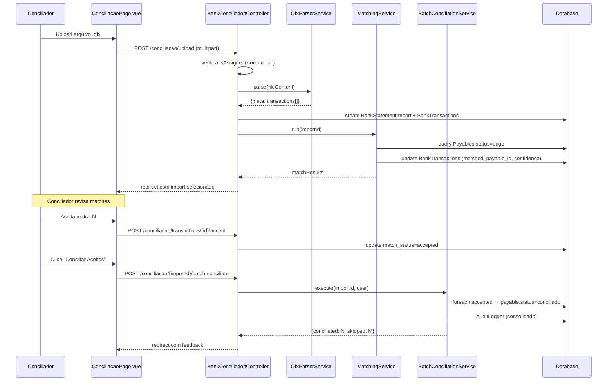
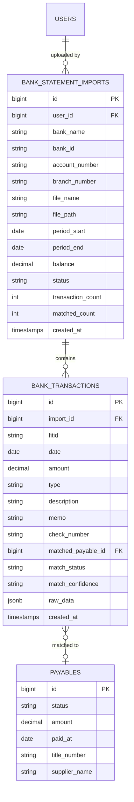

# Design Document

## Overview

Esta spec adiciona **Importação de Extrato OFX + Conciliação Assistida** ao módulo Contas a Pagar, como evolução da conciliação manual (Spec 2). O conciliador faz upload de arquivos OFX dos bancos reais do cliente, o sistema extrai transações e sugere automaticamente correspondências com títulos pagos, e o conciliador revisa e confirma em lote.

**Componentes principais:**
1. **OFX Parser** — service que interpreta as variações de formato dos 4 bancos do cliente
2. **Matching Algorithm** — sugere correspondências entre transações bancárias e títulos pagos
3. **Conciliation Workspace** — página dedicada com upload, histórico e revisão de matches
4. **Batch Conciliation** — concilia em lote os matches aceitos (reusa lógica da Spec 2)

**Princípios:**
- Reaproveitamento máximo da infraestrutura existente (alcada, auditoria, status transitions)
- Parser robusto que lida com TODAS as variações dos 4 bancos reais
- Matching inteligente com níveis de confiança (high/medium/low)
- Conciliação em lote eficiente com auditoria consolidada

## Architecture

### Visão de alto nível

```mermaid
flowchart TB
    subgraph Frontend ["Vue + Inertia + PrimeVue"]
        UP[Upload OFX]
        HIS[Histórico de Importações]
        REV[Tabela de Revisão de Matches]
        ACT[Ações: Aceitar/Rejeitar/Vincular]
        BATCH[Botão Conciliar Aceitos]
    end

    subgraph Backend ["Laravel"]
        CTRL[BankConciliationController]
        PARSER[OfxParserService]
        MATCH[MatchingService]
        BATSVC[BatchConciliationService]
        ALCADA[PayableAlcadaService]
        AUD[AuditLogger]
    end

    subgraph Database ["PostgreSQL"]
        BSI[(bank_statement_imports)]
        BT[(bank_transactions)]
        PAY[(payables)]
    end

    UP -->|POST /upload| CTRL
    CTRL --> PARSER
    PARSER --> BSI
    PARSER --> BT
    CTRL --> MATCH
    MATCH -->|query| PAY
    MATCH -->|update matched_payable_id| BT
    ACT -->|POST /accept, /reject, /link| CTRL
    BATCH -->|POST /batch-conciliate| CTRL
    CTRL --> BATSVC
    BATSVC --> ALCADA
    BATSVC -->|update status=conciliado| PAY
    BATSVC --> AUD
    HIS -->|GET /| CTRL
    REV -->|GET /{id}| CTRL
```

### Camada de autorização

| Camada | Mecanismo | Aplica a |
|---|---|---|
| **Acesso ao módulo** | middleware `permission:financeiro.contas_pagar.visualizar` | ver página, histórico |
| **Executar ações** | `PayableAlcadaService.isAssigned('conciliador')` checado no controller | upload, aceitar/rejeitar, batch conciliate |

### Fluxo completo



## Components and Interfaces

### Backend

#### 1. `App\Services\OfxParserService`

Service dedicado para parsing de arquivos OFX. Lida com todas as variações dos bancos reais do cliente.

```php
class OfxParserService
{
    /**
     * Parse completo de um arquivo OFX.
     * @return OfxParseResult {meta: OfxMeta, transactions: OfxTransaction[]}
     * @throws OfxParseException se arquivo inválido
     */
    public function parse(string $content): OfxParseResult;

    /** Extrai e valida o header OFX (linhas antes de <OFX>). */
    private function parseHeader(string $rawHeader): array;

    /** Extrai valor de uma tag OFX (suporta XML-like e SGML). */
    private function extractTagValue(string $content, string $tag): ?string;

    /** Converte TRNAMT para float: lida com dot, comma, e sinal +. */
    private function parseAmount(string $raw): float;

    /** Converte DTPOSTED para Carbon date (ignora hora/timezone). */
    private function parseDate(string $raw): Carbon;

    /** Extrai bloco BANKACCTFROM → metadados da conta. */
    private function parseAccountInfo(string $content): OfxMeta;

    /** Extrai todas as transações do bloco BANKTRANLIST. */
    private function parseTransactions(string $content): array;

    /** Extrai LEDGERBAL (saldo). */
    private function parseBalance(string $content): ?array;
}
```

**DTOs:**

```php
class OfxParseResult {
    public OfxMeta $meta;
    public array $transactions; // OfxTransaction[]
}

class OfxMeta {
    public ?string $bankId;      // BANKID (001, 033, 070, 041)
    public ?string $accountId;   // ACCTID
    public ?string $branchId;    // BRANCHID (opcional)
    public ?string $accountType; // ACCTTYPE
    public ?string $orgName;     // ORG (Banco do Brasil, SANTANDER, etc.)
    public ?Carbon $periodStart; // DTSTART
    public ?Carbon $periodEnd;   // DTEND
    public ?float $balance;      // BALAMT
    public ?Carbon $balanceDate; // DTASOF
}

class OfxTransaction {
    public string $type;       // TRNTYPE: CREDIT, DEBIT, OTHER
    public Carbon $date;       // DTPOSTED parsed
    public float $amount;      // TRNAMT parsed (sempre com sinal: - débito, + crédito)
    public ?string $fitid;     // FITID (pode ser null/empty)
    public ?string $name;      // NAME
    public ?string $memo;      // MEMO
    public ?string $checkNum;  // CHECKNUM
    public array $rawData;     // Todos os campos originais como array
}
```

**Regras de parsing por banco (baseado em análise dos arquivos reais):**

| Banco | BANKID | Closing tags | Decimal | Sinal + | FITID | Encoding |
|-------|--------|-------------|---------|---------|-------|----------|
| Banco do Brasil | 1 | Sim (`</CODE>`) | Ponto | Não | Com pontos (`831.261.103...`) ou vazio | UTF-8 |
| Santander | 033 | Não (SGML puro) | **Vírgula** (`17964,26`) | Não | Longo numérico | USASCII/1252 |
| BRB | 070 | Sim | Ponto | **Sim** (`+19992.60`) | Data+número (`20260618...707...`) | USASCII/1252 |
| Banrisul | 041 | Não | Ponto | Não | N/A (lista vazia) | USASCII/1252 |

**Algoritmo de extração de valor de tag (`extractTagValue`):**

```
1. Procura "<TAG>" no conteúdo
2. Se encontra "</TAG>" depois → valor = texto entre as duas tags (XML-like)
3. Se NÃO encontra closing tag → valor = texto após "<TAG>" até próximo "<" ou newline (SGML)
4. Trim whitespace do resultado
```

**Algoritmo de parseAmount:**

```
1. Remove espaços
2. Se contém vírgula E não contém ponto → troca vírgula por ponto (Santander)
3. Se contém vírgula E ponto → vírgula é milhar, ponto é decimal (padrão EN)
4. Se começa com "+" → remove (BRB)
5. Converte para float
```

**Algoritmo de parseDate:**

```
1. Pega os primeiros 8 chars do DTPOSTED (YYYYMMDD)
2. Ignora tudo após (hora, timezone, brackets)
3. Converte para Carbon::createFromFormat('Ymd', $date8)
```

**Filtro de transações:**
- Ignora transações com `TRNAMT == 0.00` (saldos informativos)
- Aceita transações com FITID vazio (gera ID interno: `import_{id}_seq_{n}`)

#### 2. `App\Services\BankMatchingService`

Service que executa o algoritmo de matching entre transações bancárias e títulos pagos.

```php
class BankMatchingService
{
    private const AMOUNT_TOLERANCE = 0.01;   // R$ 0.01
    private const HIGH_CONFIDENCE_DAYS = 2;  // ±2 dias
    private const MEDIUM_CONFIDENCE_DAYS = 5; // ±5 dias

    /**
     * Executa matching para todas as transações de uma importação.
     * @return array{matched: int, unmatched: int, duplicates: int}
     */
    public function run(int $importId): array;

    /**
     * Busca Payables candidatos para uma transação.
     * Retorna array de candidatos ordenados por confiança.
     */
    private function findCandidates(BankTransaction $tx): array;

    /**
     * Calcula confiança do match baseado na diferença de datas.
     */
    private function calculateConfidence(Carbon $txDate, ?Carbon $paidAt): string;
}
```

**Algoritmo de matching:**

```
Para cada BankTransaction com type=DEBIT na importação:
  1. Calcula abs_amount = abs(transaction.amount)
  2. Busca Payables WHERE:
     - status = 'pago'
     - abs(amount - abs_amount) <= 0.01
     - NÃO já vinculados a outra BankTransaction accepted/manual desta mesma importação
  3. Para cada candidato:
     - diff_days = abs(transaction.date - payable.paid_at) em dias
     - Se diff_days <= 2 → confidence = 'high'
     - Se diff_days <= 5 → confidence = 'medium'
     - Senão → confidence = 'low'
  4. Ordena candidatos por confidence (high > medium > low)
  5. Seleciona o primeiro como suggested match
  6. Se nenhum candidato → match_status = 'unmatched', confidence = 'none'
  7. Se há candidato → match_status = 'pending', matched_payable_id = melhor candidato

Para BankTransactions com type=CREDIT ou OTHER:
  - match_status = 'unmatched', confidence = 'none' (não são pagamentos)
```

**Detecção de duplicidade de pagamento:**
Se o mesmo Payable aparece como candidato para múltiplas transações na mesma importação, o service marca ambas com flag `possible_duplicate = true` no campo `raw_data` JSON.

#### 3. `App\Services\BatchConciliationService`

Service que executa conciliação em lote dos matches aceitos.

```php
class BatchConciliationService
{
    /**
     * Concilia em lote todas as transações aceitas/manuais de uma importação.
     * Reusa a lógica de transição pago→conciliado da Spec 2.
     * @return array{conciliated: int, skipped: int, errors: string[]}
     */
    public function execute(int $importId, User $user): array;
}
```

**Algoritmo:**
```
1. Verificar isAssigned($user, 'conciliador') — uma vez só
2. Buscar BankTransactions WHERE import_id = $importId AND match_status IN ('accepted', 'manual')
3. Para cada transação:
   a. DB::transaction + lockForUpdate no Payable
   b. Se payable.status != 'pago' → skip, marca transação como 'rejected' com motivo
   c. Se status == 'pago' → update conciliado (mesma lógica do PayableController@conciliate)
   d. Cria PayableComment type='conciliation' referenciando importação OFX
4. Log de auditoria consolidado: contas_pagar.conciliacao_lote
5. Atualiza BankStatementImport.matched_count
6. Retorna resultado
```

#### 4. `App\Http\Controllers\BankConciliationController`

Controller dedicado para a conciliação via OFX (separado do PayableController para manter responsabilidade única).

```php
class BankConciliationController extends Controller
{
    // GET /financeiro/contas-pagar/conciliacao
    public function index(Request $request): Response;

    // GET /financeiro/contas-pagar/conciliacao/{importId}
    public function show(int $importId): Response;

    // POST /financeiro/contas-pagar/conciliacao/upload
    public function upload(Request $request, OfxParserService $parser, BankMatchingService $matcher): RedirectResponse;

    // POST /financeiro/contas-pagar/conciliacao/transactions/{id}/accept
    public function accept(int $id): RedirectResponse;

    // POST /financeiro/contas-pagar/conciliacao/transactions/{id}/reject
    public function reject(int $id): RedirectResponse;

    // POST /financeiro/contas-pagar/conciliacao/transactions/{id}/link
    public function link(Request $request, int $id): RedirectResponse;

    // POST /financeiro/contas-pagar/conciliacao/{importId}/batch-conciliate
    public function batchConciliate(int $importId, BatchConciliationService $batch): RedirectResponse;

    // DELETE /financeiro/contas-pagar/conciliacao/{importId}
    public function destroy(int $importId): RedirectResponse;

    // GET /financeiro/contas-pagar/conciliacao/search-payables (AJAX)
    public function searchPayables(Request $request): JsonResponse;
}
```

#### 5. Rotas (`routes/web.php`)

Adicionar dentro do grupo de middleware `financeiro.contas_pagar.visualizar`:

```php
// Conciliação Bancária (OFX)
Route::prefix('financeiro/contas-pagar/conciliacao')->group(function () {
    Route::get('/', [BankConciliationController::class, 'index'])->name('bank-conciliation.index');
    Route::get('/{importId}', [BankConciliationController::class, 'show'])->whereNumber('importId')->name('bank-conciliation.show');
    Route::post('/upload', [BankConciliationController::class, 'upload'])->name('bank-conciliation.upload');
    Route::post('/transactions/{id}/accept', [BankConciliationController::class, 'accept'])->whereNumber('id')->name('bank-conciliation.accept');
    Route::post('/transactions/{id}/reject', [BankConciliationController::class, 'reject'])->whereNumber('id')->name('bank-conciliation.reject');
    Route::post('/transactions/{id}/link', [BankConciliationController::class, 'link'])->whereNumber('id')->name('bank-conciliation.link');
    Route::post('/{importId}/batch-conciliate', [BankConciliationController::class, 'batchConciliate'])->whereNumber('importId')->name('bank-conciliation.batch');
    Route::delete('/{importId}', [BankConciliationController::class, 'destroy'])->whereNumber('importId')->name('bank-conciliation.destroy');
    Route::get('/search-payables', [BankConciliationController::class, 'searchPayables'])->name('bank-conciliation.search-payables');
});
```

#### 6. Menu do sidebar

Adicionar item no grupo Financeiro, após "Contas a Pagar":

```
Financeiro
├── Contas a Pagar      → /financeiro/contas-pagar
├── Conciliação Bancária → /financeiro/contas-pagar/conciliacao  [NOVO]
├── Borderôs            → /financeiro/borderos
└── Alçada CP           → /financeiro/contas-pagar/alcada
```

Permissão: `financeiro.contas_pagar.visualizar` (mesma do módulo).

### Frontend

#### A. `resources/js/Pages/BankConciliation/Index.vue`

Página principal de conciliação bancária. Decide entre versão desktop e mobile via `useDevice()`.

**Desktop:**
- Header com título "Conciliação Bancária"
- Área de upload (FileUpload PrimeVue com `accept=".ofx"`, drag & drop) — visível só para conciliador
- DataTable de importações anteriores: data, banco, conta, período, transações, matches, status
- Clicar em uma importação → navega para `show`

**Mobile:**
- Cards de importações (sem DataTable)
- FAB de upload ou card simplificado
- Tap em card → navega para `show`

**Props recebidas do controller:**
```ts
interface Props {
    imports: Paginated<BankStatementImport>;
    isConciliador: boolean;
}
```

#### B. `resources/js/Pages/BankConciliation/Show.vue`

Detalhe de uma importação — tabela de transações com ações de revisão.

**Desktop:**
- Resumo no topo: banco, conta, período, saldo, contadores (total débitos, matched, pending, unmatched)
- DataTable de transações: data, valor, descrição, match (chip com link para payable), confiança (badge), ação
- Filtros: match_status (tabs ou dropdown)
- Coluna de ação:
  - Match pending → botões "Aceitar" / "Rejeitar"
  - Match accepted → chip verde "Aceito" + botão "Desfazer"
  - Match rejected → chip vermelho "Rejeitado" + botão "Vincular manualmente"
  - Unmatched → botão "Vincular"
- Rodapé sticky: botão "Conciliar Aceitos (N)" — habilitado quando N > 0
- Dialog de busca manual de Payable (abre ao clicar Vincular)

**Mobile:**
- Resumo em cards compactos
- Lista de transações como cards verticais
- Tap em transação → bottom sheet com detalhes + ações
- Bottom sheet de busca manual
- Bottom sheet de confirmação de batch conciliation

**Props:**
```ts
interface Props {
    import: BankStatementImport;
    transactions: Paginated<BankTransaction>;
    counters: {total_debits: number, matched: number, pending: number, unmatched: number, rejected: number};
    isConciliador: boolean;
    filters: {match_status?: string};
}
```

#### C. Atributos `dusk` requeridos

- `upload-ofx` — FileUpload/botão de upload
- `import-row-{id}` — linha da DataTable de importações
- `transaction-row-{id}` — linha/card de transação
- `btn-accept-{id}` — botão aceitar match
- `btn-reject-{id}` — botão rejeitar match
- `btn-link-{id}` — botão vincular manualmente
- `btn-batch-conciliate` — botão conciliar aceitos
- `search-payable-dialog` — dialog de busca manual
- `search-payable-input` — input de busca
- `search-payable-result-{id}` — item de resultado da busca
- `batch-confirm` — botão confirmar conciliação em lote
- `counter-matched` — exibe contagem de matched
- `counter-pending` — exibe contagem de pendentes

## Data Models

### Migration 1: `create_bank_statement_imports_table`

```php
Schema::create('bank_statement_imports', function (Blueprint $table) {
    $table->id();
    $table->foreignId('user_id')->constrained()->cascadeOnDelete();
    $table->string('bank_name')->nullable();       // ORG do OFX
    $table->string('bank_id', 10)->nullable();     // BANKID (001, 033, 070, 041)
    $table->string('account_number', 50);          // ACCTID
    $table->string('branch_number', 20)->nullable(); // BRANCHID
    $table->string('file_name');                   // nome original
    $table->string('file_path');                   // storage path
    $table->date('period_start')->nullable();      // DTSTART
    $table->date('period_end')->nullable();        // DTEND
    $table->decimal('balance', 15, 2)->nullable(); // BALAMT
    $table->string('status', 20)->default('processing'); // processing, done, error
    $table->unsignedInteger('transaction_count')->default(0);
    $table->unsignedInteger('matched_count')->default(0);
    $table->text('error_message')->nullable();
    $table->timestamps();

    $table->index(['user_id', 'created_at']);
    $table->index('status');
});
```

### Migration 2: `create_bank_transactions_table`

```php
Schema::create('bank_transactions', function (Blueprint $table) {
    $table->id();
    $table->foreignId('import_id')->constrained('bank_statement_imports')->cascadeOnDelete();
    $table->string('fitid', 100)->nullable();
    $table->date('date');
    $table->decimal('amount', 15, 2);              // valor absoluto
    $table->string('type', 10);                    // credit, debit, other
    $table->string('description', 500)->nullable(); // NAME ou MEMO
    $table->string('memo', 500)->nullable();
    $table->string('check_number', 50)->nullable();
    $table->foreignId('matched_payable_id')->nullable()->constrained('payables')->nullOnDelete();
    $table->string('match_status', 20)->default('pending'); // pending, accepted, rejected, manual, unmatched
    $table->string('match_confidence', 10)->default('none'); // high, medium, low, none
    $table->jsonb('raw_data')->nullable();
    $table->timestamps();

    $table->index(['import_id', 'match_status']);
    $table->index('matched_payable_id');
    $table->index(['import_id', 'type']);
});
```

### ER Diagram



### Models

#### `App\Models\BankStatementImport`

```php
class BankStatementImport extends Model
{
    use Auditable;

    protected $fillable = [
        'user_id', 'bank_name', 'bank_id', 'account_number', 'branch_number',
        'file_name', 'file_path', 'period_start', 'period_end', 'balance',
        'status', 'transaction_count', 'matched_count', 'error_message',
    ];

    protected function casts(): array
    {
        return [
            'period_start' => 'date',
            'period_end' => 'date',
            'balance' => 'decimal:2',
        ];
    }

    public function user(): BelongsTo { return $this->belongsTo(User::class); }
    public function transactions(): HasMany { return $this->hasMany(BankTransaction::class, 'import_id'); }
}
```

#### `App\Models\BankTransaction`

```php
class BankTransaction extends Model
{
    protected $fillable = [
        'import_id', 'fitid', 'date', 'amount', 'type', 'description',
        'memo', 'check_number', 'matched_payable_id', 'match_status',
        'match_confidence', 'raw_data',
    ];

    protected function casts(): array
    {
        return [
            'date' => 'date',
            'amount' => 'decimal:2',
            'raw_data' => 'array',
        ];
    }

    public function import(): BelongsTo { return $this->belongsTo(BankStatementImport::class, 'import_id'); }
    public function matchedPayable(): BelongsTo { return $this->belongsTo(Payable::class, 'matched_payable_id'); }
}
```

## Correctness Properties

*A property is a characteristic or behavior that should hold true across all valid executions of a system — essentially, a formal statement about what the system should do. Properties serve as the bridge between human-readable specifications and machine-verifiable correctness guarantees.*

### Property 1: Amount parsing round-trip

*For any* valid monetary amount (positive or negative, with dot or comma decimal separator, with or without explicit + sign), the `parseAmount` function SHALL produce a float that, when formatted back with 2 decimal places, equals the original numeric value.

**Validates: Requirements 1.4, 1.5, 1.6**

### Property 2: Date parsing preserves date component

*For any* valid date (YYYYMMDD) combined with any timezone suffix (empty, `[-3:BRT]`, `[-03:BRT]`, `[-3:GMT]`, or bare timestamp `YYYYMMDDHHMMSS`), the `parseDate` function SHALL extract the same date (year, month, day) regardless of the timezone/time suffix.

**Validates: Requirements 1.7, 1.8**

### Property 3: Tag value extraction consistency

*For any* tag name and any value string (not containing `<` characters), extracting the value from both XML-like format (`<TAG>value</TAG>`) and SGML format (`<TAG>value\n<NEXT>`) SHALL return the same trimmed value string.

**Validates: Requirements 1.2, 1.3**

### Property 4: Matching confidence classification

*For any* Payable with status `pago` and any BankTransaction of type `debit` where `abs(transaction.amount - payable.amount) <= 0.01`, the match confidence SHALL be determined solely by the absolute difference in days between `transaction.date` and `payable.paid_at`: `high` if ≤ 2 days, `medium` if 3-5 days, `low` if > 5 days.

**Validates: Requirements 3.2, 3.3, 3.4**

### Property 5: Matching excludes non-pago payables

*For any* Payable with status different from `pago` (pendente, aprovado, conciliado, divergente), the Matching_Algorithm SHALL never include that Payable as a candidate match, regardless of amount or date proximity.

**Validates: Requirements 3.9**

### Property 6: Batch conciliation invariant

*For any* set of BankTransactions with match_status `accepted` or `manual` linked to valid Payables in status `pago`, after batch conciliation ALL linked Payables SHALL have status `conciliado` with `conciliated_at` and `conciliated_by` set, and the count of conciliated Payables SHALL equal the count of processed transactions.

**Validates: Requirements 5.1, 5.4**

## Error Handling

| Cenário | Tratamento | Resposta | Req |
|---|---|---|---|
| Arquivo não é OFX (sem OFXHEADER) | `OfxParseException` | 422 + mensagem descritiva | R1.14 |
| Arquivo OFX corrompido (sem bloco OFX) | `OfxParseException` | 422 + mensagem | R1.14 |
| Upload sem ser conciliador | `abort(403)` | 403 | R6.2 |
| Accept/reject/link sem ser conciliador | `abort(403)` | 403 | R6.2 |
| Batch conciliate sem ser conciliador | `abort(403)` | 403 | R6.2 |
| Batch com 0 transações aceitas | Guard no service | `back('error')` informativo | R5.8 |
| Payable mudou de status durante batch | Skip + log | Continua lote, reporta skipados | R5.3 |
| Import não encontrada | `findOrFail` | 404 | - |
| Transaction não encontrada | `findOrFail` | 404 | - |
| Link com payable inválido (não pago) | Validação | 422 | R4.4 |
| Arquivo maior que 10MB | `validate max:10240` | 422 | - |
| Delete de import com transações conciliadas | Guard | `back('error')` | R2.4 |
| Concorrência: dois uploads simultâneos | Ambos processados normalmente | Duplicidade alertada | R2.3 |

## Testing Strategy

### Por que property-based testing nesta spec

O **OFX Parser** é uma função pura com espaço amplo de entrada: variações de formato decimal (ponto/vírgula), sinal (+/-), timezone em datas, e formatos de tag (XML vs SGML). As propriedades de parsing (round-trip de valores, consistência de extração de tags, classificação de confiança) são universais e se beneficiam de 100+ iterações com inputs aleatórios.

**Library**: [PHPUnit com data providers extensivos](https://docs.phpunit.de/en/11.0/writing-tests-for-phpunit.html#data-providers) — PHP não tem um framework PBT padrão de mercado como Hypothesis/QuickCheck, mas usaremos data providers com geração randomizada via Faker para simular o comportamento de PBT com 100+ iterações.

### Backend — Feature Tests (PHPUnit, `RefreshDatabase`)

**`tests/Feature/OfxParserTest.php`** — Testes do parser:
1. Parse arquivo BB completo → extrai transações com valores corretos
2. Parse arquivo Santander (vírgula decimal) → valores corretos
3. Parse arquivo BRB (sinal +) → valores corretos
4. Parse arquivo Banrisul (lista vazia) → retorna vazio sem erro
5. Parse arquivo inválido → exception
6. **Property tests via data provider** (100+ combinações): parseAmount, parseDate, extractTagValue

**`tests/Feature/BankMatchingTest.php`** — Testes do matching:
1. Match exato (valor + ±2 dias) → confidence high
2. Match médio (valor + 3-5 dias) → confidence medium
3. Match baixo (valor + >5 dias) → confidence low
4. Sem match (valor diferente) → unmatched
5. Crédito → unmatched (sem matching)
6. Payable já conciliado → não aparece como candidato
7. Múltiplos candidatos → ordenados por confidence
8. **Property test via data provider** (100+ combinações): confidence classification

**`tests/Feature/BankConciliationTest.php`** — Testes do controller:
1. Upload OFX como conciliador → cria import + transactions + roda matching
2. Upload sem ser conciliador → 403
3. Upload arquivo inválido → 422
4. Accept transação → match_status=accepted
5. Reject transação → match_status=rejected, matched_payable_id null
6. Link manual → match_status=manual, matched_payable_id set
7. Batch conciliate → payables viram conciliado, audit log criado
8. Batch sem aceitos → erro informativo
9. Batch com payable que mudou status → skip + continua
10. Delete import → cascata OK
11. Delete import com transações conciliadas → erro
12. Visualização sem ser conciliador → OK (read-only)
13. Search payables → retorna só status pago

### Frontend — Dusk (`tests/Browser/`)

**`tests/Browser/BankConciliationTest.php`**:

Login como `bruno@bstechsolutions.com` (conciliador).

1. **Página carrega**: navega → vê título "Conciliação Bancária", área de upload visível
2. **Upload OFX**: faz upload de arquivo de teste → redirect para show com transações
3. **Ver transações**: tabela exibe data, valor, descrição, badge de confidence
4. **Aceitar match**: clica "Aceitar" → badge muda para "Aceito" (verde)
5. **Rejeitar match**: clica "Rejeitar" → badge muda para "Rejeitado"
6. **Vincular manual**: clica "Vincular" → abre dialog de busca → seleciona payable → vinculado
7. **Batch conciliar**: clica "Conciliar Aceitos" → confirma → toast sucesso + contadores atualizados
8. **Mobile - upload**: resize(375,800) → vê FAB/card de upload
9. **Mobile - ações**: tap em transação → bottom sheet com ações
10. **Read-only para não-conciliador**: login como user sem papel conciliador → vê histórico mas sem botões de ação

### Gotchas
- `<Toast />` deve ser renderizado no template da página
- Textos com `text-transform:uppercase` são vistos em MAIÚSCULAS pelo Selenium
- Atributos `dusk="..."` em todos elementos interativos
- Fixtures de teste: copiar os 4 arquivos OFX reais para `tests/fixtures/ofx/`

### Property-Based Test Configuration

Cada property test usa data provider com 100+ iterações geradas via Faker:
- Tag format: `/** Feature: contas-pagar-conciliacao-ofx, Property N: [title] */`
- Mínimo 100 combinações por property
- Data providers geram inputs aleatórios representando todas as variações

## Decisões de design

1. **Controller separado (`BankConciliationController`)**: a responsabilidade é diferente do `PayableController` (que gerencia títulos individuais). Página dedicada com upload + revisão justifica controller próprio.
2. **Services independentes**: `OfxParserService` é puro (stateless, testável isolado), `BankMatchingService` consulta DB mas é determinístico dado os inputs, `BatchConciliationService` orquestra a transação.
3. **Tolerância de R$ 0.01**: arredondamentos bancários acontecem; exigir igualdade exata causaria falsos negativos.
4. **Janela de ±2/±5 dias**: compensação de TED = D+1, boleto = D+2-3, feriados podem estender. High confidence (±2) cobre o caso comum; medium (±5) pega os atrasados.
5. **Sem OFX parsing externo**: o formato SGML do OFX brasileiro é simples e os bancos do cliente já foram mapeados. Um parser interno é mais manutenível que depender de packages abandonados (todos os OFX parsers PHP estão sem manutenção).
6. **Batch reusa lógica da Spec 2**: a transição `pago→conciliado` é a mesma; batch adiciona escala + auditoria consolidada.
7. **Armazenamento do arquivo**: guardado em `storage/app/private/ofx/{import_id}/` — privado, não acessível publicamente.
8. **FITID vazio aceito**: o BB coloca FITID vazio em "Saldo Anterior" — se o valor for 0.00 é filtrado; se não for, é aceito com ID interno gerado.
9. **Visualização aberta**: qualquer user com permissão do módulo pode ver importações (transparência), mas só conciliador executa ações (segregação).
