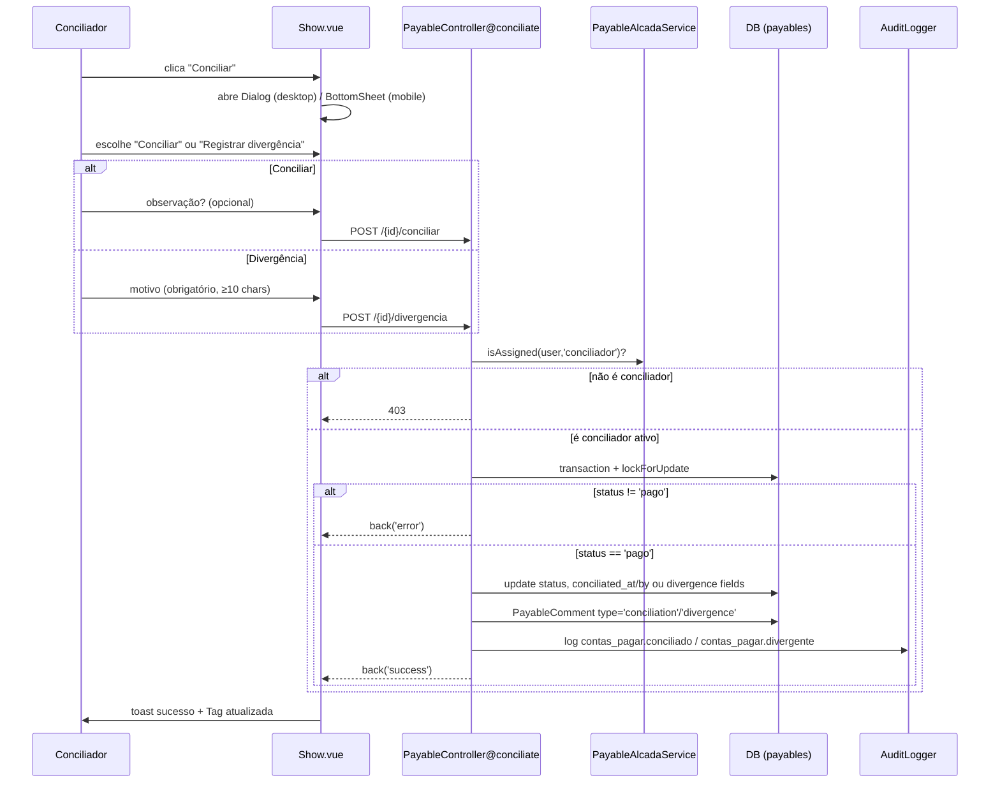
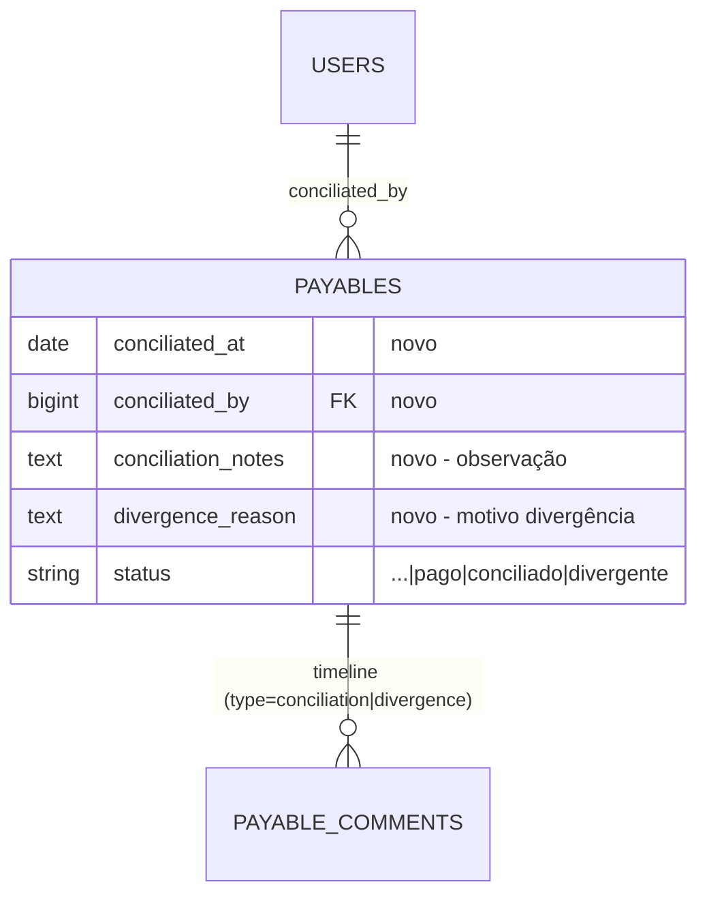

# Design Document

## Overview

Esta spec adiciona a **Conciliação Bancária** ao módulo Contas a Pagar, de forma incremental sobre a Spec 1 (alçada + pagamento). O conciliador — papel já existente na `payable_roles` — passa a ter uma ação concreta: verificar títulos `pago` e marcá-los como `conciliado` ou `divergente`.

**Duas novas transições de status:**
- `pago` → `conciliado` (pagamento confere com o banco)
- `pago` → `divergente` (pagamento não confere)

**Princípios:**
- **Reaproveitamento máximo**: reusa `PayableAlcadaService.isAssigned('conciliador')`, `PayableComment`, `PayableDocument`, `AuditLogger`, a tela `Payables/Show.vue` e o padrão de `pay()`.
- **Segregação de função**: conciliar é governado pela alçada (`conciliador`), não pela permissão — `*` não fura.
- **Mesmo padrão de concorrência**: `lockForUpdate` + recheck de status dentro da transação.
- **Auditoria + timeline** em toda transição.
- **Mobile dedicado** (bottom sheet, como o pagamento).

## Architecture

### Visão de alto nível

```mermaid
flowchart LR
    subgraph Frontend [Vue + Inertia + PrimeVue]
        S[Payables/Show.vue<br/>+ Conciliar / Divergência]
    end
    subgraph Backend [Laravel]
        PC[PayableController@conciliate<br/>PayableController@diverge]
        SVC[PayableAlcadaService<br/>isAssigned conciliador]
        M2[(payables<br/>+ conciliated_at/conciliated_by<br/>+ conciliation_notes/divergence_reason)]
        AUD[AuditLogger -> audit_logs]
    end

    S -->|POST conciliar| PC
    S -->|POST divergencia| PC
    PC --> SVC
    PC --> M2
    PC --> AUD
    PC -.->|share canConciliate| S
```

### Camada de autorização (mesmo padrão da Spec 1)

| Camada | Mecanismo | Aplica a |
|---|---|---|
| **Acesso ao módulo** | middleware `permission:financeiro.contas_pagar.visualizar` | ver detalhe/lista |
| **Executar conciliação** | **pertencer à Alcada_CP como `conciliador` e estar ativo** (checado no controller; `*` não fura) | ações conciliar/divergir |

### Fluxo de Conciliação



## Components and Interfaces

### Backend

#### 1. Migration — `add_conciliation_fields_to_payables`

Adiciona colunas de conciliação à tabela `payables`:

| Coluna | Tipo | Notas |
|---|---|---|
| `conciliated_at` | `date` nullable | data da conciliação |
| `conciliated_by` | `foreignId` nullable → `users.id` (`nullOnDelete`) | quem conciliou |
| `conciliation_notes` | `text` nullable | observação opcional da conciliação |
| `divergence_reason` | `text` nullable | motivo obrigatório da divergência |

> O `conciliated_by` e `conciliated_at` servem tanto para conciliação quanto para divergência (registra quem fez a ação e quando). O `divergence_reason` é preenchido somente quando status = `divergente`.

#### 2. Ajustes no Model `Payable`

```php
// Novos status
public const STATUS_LABELS = [
    // ... existentes ...
    'conciliado' => 'Conciliado',
    'divergente' => 'Divergente',
];

public const STATUS_COLORS = [
    // ... existentes ...
    'conciliado' => 'success',
    'divergente' => 'danger',
];

// Workflow fields (não sobrescritos pela sync Senior)
public const WORKFLOW_FIELDS = [
    // ... existentes ...
    'conciliated_at', 'conciliated_by', 'conciliation_notes', 'divergence_reason',
];

// Fillable: adicionar os 4 novos campos
// Casts: conciliated_at => date
// Relação: conciliator(): BelongsTo (conciliated_by)
```

#### 3. `PayableController@conciliate` (novo método)

```php
public function conciliate(Request $request, int $id, PayableAlcadaService $alcada)
{
    $payable = Payable::findOrFail($id);
    $user = $request->user();

    if (! $alcada->isAssigned($user, 'conciliador')) {
        abort(403, 'Você não está na alçada como conciliador deste módulo.');
    }

    $data = $request->validate([
        'notes' => ['nullable', 'string', 'max:1000'],
    ]);

    $done = DB::transaction(function () use ($payable, $user, $data) {
        $fresh = Payable::whereKey($payable->id)->lockForUpdate()->first();

        if ($fresh->status !== 'pago') {
            return false;
        }

        $old = $fresh->status;
        $fresh->update([
            'status' => 'conciliado',
            'conciliated_at' => now()->toDateString(),
            'conciliated_by' => $user->id,
            'conciliation_notes' => $data['notes'] ?? null,
        ]);

        PayableComment::create([
            'payable_id' => $fresh->id,
            'user_id' => $user->id,
            'body' => 'Conciliação realizada'
                . (($data['notes'] ?? null) ? " — {$data['notes']}" : ''),
            'type' => 'conciliation',
        ]);

        AuditLogger::log(
            event: 'contas_pagar.conciliado',
            module: 'financeiro.contas_pagar',
            description: "Título {$fresh->title_number} conciliado (R$ {$fresh->amount})",
            auditable: $fresh,
            oldValues: ['status' => $old],
            newValues: ['status' => 'conciliado', 'conciliated_at' => now()->toDateString(),
                        'conciliated_by' => $user->id, 'conciliation_notes' => $data['notes'] ?? null],
        );

        return true;
    });

    if (! $done) {
        return back()->with('error', 'Este título não está apto a ser conciliado.');
    }

    return back()->with('success', 'Conciliação registrada.');
}
```

#### 4. `PayableController@diverge` (novo método)

```php
public function diverge(Request $request, int $id, PayableAlcadaService $alcada)
{
    $payable = Payable::findOrFail($id);
    $user = $request->user();

    if (! $alcada->isAssigned($user, 'conciliador')) {
        abort(403, 'Você não está na alçada como conciliador deste módulo.');
    }

    $data = $request->validate([
        'reason' => ['required', 'string', 'min:10', 'max:1000'],
    ]);

    $done = DB::transaction(function () use ($payable, $user, $data) {
        $fresh = Payable::whereKey($payable->id)->lockForUpdate()->first();

        if ($fresh->status !== 'pago') {
            return false;
        }

        $old = $fresh->status;
        $fresh->update([
            'status' => 'divergente',
            'conciliated_at' => now()->toDateString(),
            'conciliated_by' => $user->id,
            'divergence_reason' => $data['reason'],
        ]);

        PayableComment::create([
            'payable_id' => $fresh->id,
            'user_id' => $user->id,
            'body' => "Divergência registrada — {$data['reason']}",
            'type' => 'divergence',
        ]);

        AuditLogger::log(
            event: 'contas_pagar.divergente',
            module: 'financeiro.contas_pagar',
            description: "Título {$fresh->title_number} marcado como divergente: {$data['reason']}",
            auditable: $fresh,
            oldValues: ['status' => $old],
            newValues: ['status' => 'divergente', 'conciliated_at' => now()->toDateString(),
                        'conciliated_by' => $user->id, 'divergence_reason' => $data['reason']],
        );

        return true;
    });

    if (! $done) {
        return back()->with('error', 'Este título não está apto para registro de divergência.');
    }

    return back()->with('success', 'Divergência registrada.');
}
```

#### 5. `PayableController@show` (ajuste)

Adicionar ao método `show()` existente:

- Eager-load `conciliator:id,name` (nova relação).
- Props novas para a view:
  - `canConciliate` = `$alcada->isAssigned($user, 'conciliador') && $payable->status === 'pago'`
  - `conciliadorConfigured` = `$alcada->hasRole('conciliador')`

#### 6. Rotas (`routes/web.php`)

Adicionar dentro do grupo `financeiro/contas-pagar`:

```php
Route::post('/{id}/conciliar', [PayableController::class, 'conciliate'])
    ->whereNumber('id')->name('payables.conciliate');
Route::post('/{id}/divergencia', [PayableController::class, 'diverge'])
    ->whereNumber('id')->name('payables.diverge');
```

Ambas protegidas pelo mesmo middleware de acesso ao módulo (`financeiro.contas_pagar.visualizar`). A elegibilidade do conciliador é checada **dentro** do controller (não por middleware separado), identicamente ao `pay()`.

### Frontend

#### A. `resources/js/Pages/Payables/Show.vue` (ajuste)

Adicionar ao bloco de ações da sidebar, **após** o bloco de pagamento:

**Bloco "Conciliação"** visível quando `canConciliate`:
- Botão **"Conciliar"** (`dusk="open-conciliation"`) que abre:
  - **Desktop**: PrimeVue `Dialog` com:
    - Dois botões de ação: "Conciliar" (`dusk="action-conciliate"`) e "Registrar divergência" (`dusk="action-diverge"`)
    - **Ao clicar "Conciliar"**: exibe `Textarea` observação opcional (`dusk="conciliation-notes"`) + botão Confirmar (`dusk="confirm-conciliation"`)
    - **Ao clicar "Registrar divergência"**: exibe `Textarea` motivo obrigatório (`dusk="divergence-reason"`) + botão Confirmar com `severity="danger"` (`dusk="confirm-divergence"`)
  - **Mobile** (`isMobile`): `BottomSheet.vue` com mesmo conteúdo, campos full-width, confirmar fixo no rodapé.

**Submit conciliação**:
```js
useForm({ notes }).post(`/financeiro/contas-pagar/${id}/conciliar`, {
    preserveScroll: true,
    onSuccess: () => { /* fecha dialog/sheet, reset form */ }
})
```

**Submit divergência**:
```js
useForm({ reason }).post(`/financeiro/contas-pagar/${id}/divergencia`, {
    preserveScroll: true,
    onSuccess: () => { /* fecha dialog/sheet, reset form */ }
})
```

**Bloco read-only "Conciliação"** quando `payable.status === 'conciliado'`:
- Data conciliação, nome do conciliador, observação (se houver)
- Estilo: bloco informativo com ícone check

**Bloco read-only "Divergência"** quando `payable.status === 'divergente'`:
- Data, nome do responsável, motivo
- Estilo: bloco com borda/cor `danger` (vermelho)

**Props novas recebidas do servidor**:
- `canConciliate: Boolean`
- `conciliadorConfigured: Boolean`

**Hint**: se `status === 'pago' && !conciliadorConfigured`, exibir aviso "Alçada de conciliação não configurada".

#### B. Atributos `dusk` requeridos

- `open-conciliation` — botão que abre o form
- `conciliation-sheet` — o BottomSheet (mobile)
- `action-conciliate` — opção "Conciliar"
- `action-diverge` — opção "Registrar divergência"
- `conciliation-notes` — textarea observação
- `divergence-reason` — textarea motivo
- `confirm-conciliation` — botão confirmar conciliação
- `confirm-divergence` — botão confirmar divergência

## Data Models



- `payables`: + `conciliated_at` (date, nullable), `conciliated_by` (foreignId nullable → users, nullOnDelete), `conciliation_notes` (text, nullable), `divergence_reason` (text, nullable).
- `payable_comments.type`: aceita novos valores `conciliation` e `divergence`.
- `Payable::STATUS_LABELS` e `STATUS_COLORS`: dois novos entries.
- `Payable::WORKFLOW_FIELDS`: + 4 novos campos.

## Error Handling

| Cenário | Tratamento | Resposta | Req |
|---|---|---|---|
| Conciliar sem ser `conciliador` (mesmo com `*`) | `abort(403)` | 403 | R1.2 |
| Conciliador inativo | `isAssigned` filtra `is_active` → 403 | 403 | R1.1 |
| Nenhum conciliador configurado | `isAssigned` false → 403; UI mostra hint | 403 | R1.4 |
| Status ≠ `pago` | guard dentro da transação | `back('error')` | R2.5, R3.5, R4.2 |
| Conciliação concorrente | `lockForUpdate` + recheck | só 1 efetiva; 2ª recusada | R2.6, R4.3 |
| `notes` > 1000 chars | `validate max:1000` | 422 | R2.2 |
| `reason` ausente ou < 10 chars na divergência | `validate required|min:10` | 422 | R3.2 |
| `reason` > 1000 chars na divergência | `validate max:1000` | 422 | R3.2 |

## Testing Strategy

> Regra inegociável: **testes verdes dos dois lados antes de qualquer deploy.**

### Por que NÃO property-based testing nesta spec

Esta feature é composta de:
- Transições de estado (CRUD com validação de estado)
- Autorização por alçada (checagem booleana)
- Persistência em banco

Nenhum critério de aceitação envolve funções puras com espaço amplo de entrada, parsing/serialização, ou algoritmos onde 100 iterações revelariam mais bugs que 2-3 exemplos. O testing adequado é **feature tests** (PHPUnit) + **Dusk** (browser).

### Backend — Feature (PHPUnit, `RefreshDatabase`)

**`tests/Feature/PayableConciliacaoTest.php`**:

1. **Conciliador concilia título pago** → `assertDatabaseHas('payables', ['status'=>'conciliado', 'conciliated_by'=>...])` + comment `type=conciliation` + audit `contas_pagar.conciliado`
2. **Conciliador com observação** → `conciliation_notes` persistida
3. **Conciliador sem observação** → funciona (campo nullable)
4. **Não-conciliador com `*` → 403** (segregação)
5. **Conciliador inativo → 403**
6. **Status ≠ pago → recusa**, status preservado
7. **Idempotência**: conciliar 2x → 2ª recusada, 1 só efeito
8. **Divergência registrada** → `assertDatabaseHas('payables', ['status'=>'divergente', 'divergence_reason'=>...])` + comment `type=divergence` + audit `contas_pagar.divergente`
9. **Divergência sem motivo → 422** (`assertJsonValidationErrors(['reason'])`)
10. **Divergência com motivo < 10 chars → 422**
11. **Divergência com motivo > 1000 chars → 422**
12. **Sem conciliador configurado → 403 para todos**
13. **Filtro de status** na index: `?status=conciliado` e `?status=divergente` retornam títulos corretos

### Frontend — Dusk (`tests/Browser/`)

**`tests/Browser/PayableConciliacaoTest.php`**:

Login como `bruno@bstechsolutions.com`, setup: cria `Payable` `pago` + associa bruno como `conciliador`.

1. **Desktop — Conciliar**: detalhe mostra `@open-conciliation`; abre Dialog; clica `@action-conciliate`; campo notes aparece; `@confirm-conciliation` → toast sucesso + Tag "CONCILIADO" (uppercase) + bloco read-only conciliação. `assertDatabaseHas('payables', ['status'=>'conciliado'])`.
2. **Desktop — Divergência**: abre Dialog; clica `@action-diverge`; campo reason aparece; preenche motivo; `@confirm-divergence` → toast + Tag "DIVERGENTE" + bloco read-only divergência (vermelho).
3. **Mobile** (`resize(375,800)`): form abre como bottom sheet (`@conciliation-sheet`); conclui conciliação.
4. **Título não-pago**: não mostra o botão `@open-conciliation`.
5. **Read-only conciliado**: título `conciliado` mostra bloco com data + conciliador.
6. **Read-only divergente**: título `divergente` mostra bloco com motivo em vermelho.

### Gotchas a respeitar
- **`<Toast />`** já existe em `Show.vue` (adicionado na Spec 1) — manter.
- Texto com `text-transform:uppercase` é "visto" em MAIÚSCULAS pelo Selenium.
- Atributos `dusk="..."` em todos os elementos interativos.

## Mapeamento Requisitos → Componentes

| Requisito | Onde é atendido |
|---|---|
| R1 Elegibilidade conciliador | `conciliate()`/`diverge()` → `isAssigned('conciliador')`, prop `canConciliate` |
| R2 Conciliar título pago | `conciliate()`, migration, `PayableComment type=conciliation` |
| R3 Registrar divergência | `diverge()`, validação `reason min:10`, `PayableComment type=divergence` |
| R4 Validação de estado | guard `status==='pago'` + `lockForUpdate` |
| R5 Auditoria + timeline | `AuditLogger contas_pagar.conciliado/divergente`, `PayableComment` |
| R6 Novos status no modelo | `STATUS_LABELS`, `STATUS_COLORS`, `WORKFLOW_FIELDS`, migration |
| R7 Desktop | Dialog com opções conciliar/divergir, blocos read-only, toast |
| R8 Mobile | BottomSheet com mesmo conteúdo |
| R9 DemoSeeder | Seeder com títulos conciliados + divergente + bruno como conciliador |

## Decisões de design

1. **Duas rotas separadas** (`conciliar` e `divergencia`) em vez de uma com parâmetro — clareza semântica, validações diferentes (notes nullable vs reason required), eventos de auditoria distintos.
2. **`conciliated_at` e `conciliated_by` usados em ambos os casos** (conciliação e divergência) — registram quem fez a verificação e quando, independente do resultado.
3. **Sem nova permissão** — a ação é governada exclusivamente pela alçada (papel `conciliador`), como o pagamento é pelo `pagador`. O acesso ao módulo já é checado pelo middleware existente.
4. **`divergence_reason` separado de `conciliation_notes`** — semântica diferente (um é obrigatório, outro opcional), e facilita queries/filtros futuros.
5. **Concorrência**: mesmo padrão do `pay()` — `lockForUpdate` + recheck.
6. **Dialog com duas opções** (conciliar vs. divergir) em vez de dois botões separados na sidebar — UX mais coesa, o conciliador faz uma escolha dentro do mesmo fluxo.
